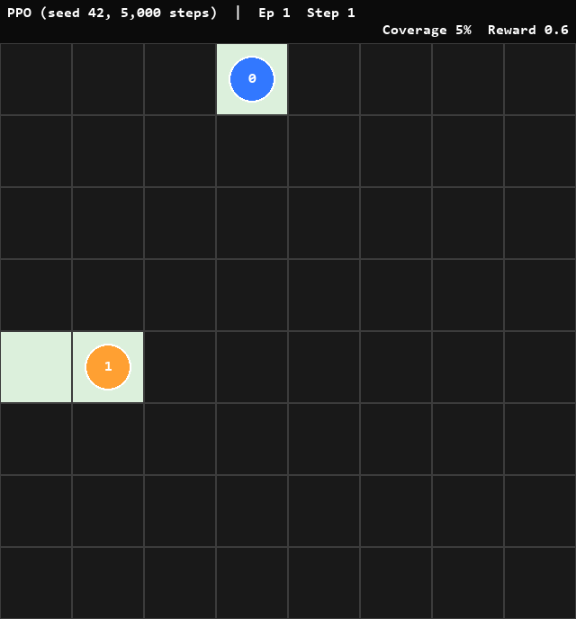
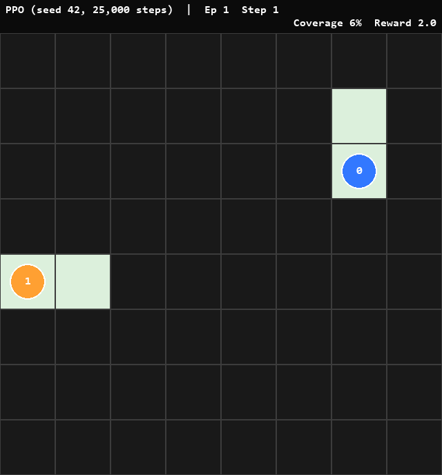
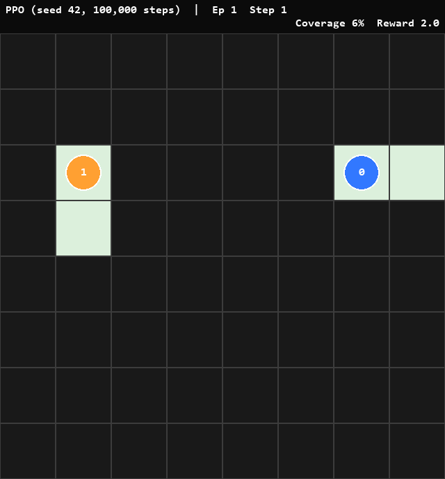
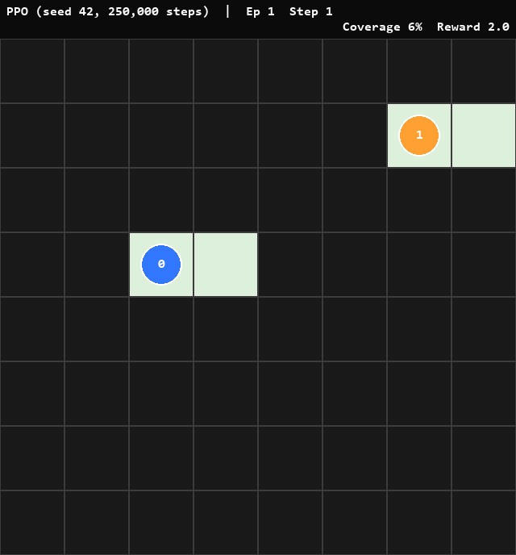
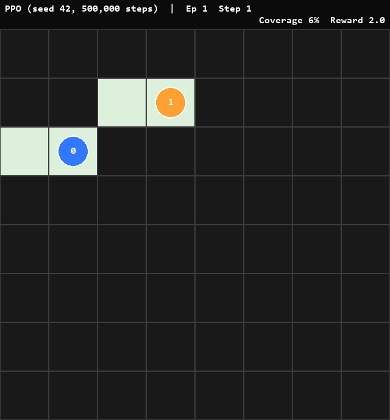
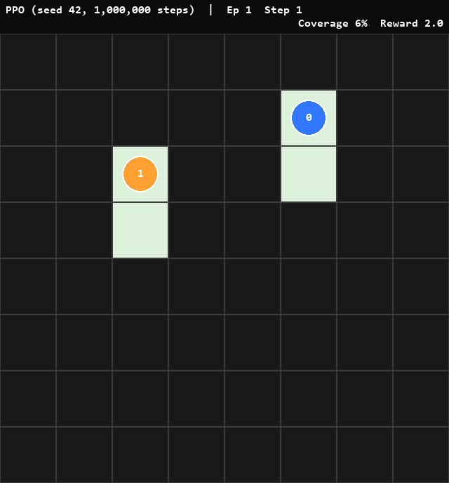

# Multi-agentski AI sistem za autonomno upravljanje mobilnim robotima

## Pokretanje Projekta

### 1. Kloniranje Repozitorija
```bash
git clone https://github.com/SafetImamovic/MultiAgentRobot
cd MultiAgentRobot
````

### 2. Virtual environment

```bash
python -m venv .venv
```

### 3. Aktiviranje Virtual environment-a

* **Windows (PowerShell)**
```powershell
.\.venv\Scripts\Activate.ps1
```

* **Windows (cmd)**
```cmd
.\.venv\Scripts\activate.bat
```

* **Linux / macOS**
```bash
source .venv/bin/activate
```

### 4. Zavisnosti
```bash
pip install --upgrade pip
pip install -r requirements.txt
```

### 5. Pokretanje

```bash
python .\src\main.py
```

> ⚡ Opcionalno: `headless` mode (bez Pygame prozora)
```bash
python .\src\main.py --headless
```

## PPO trajektorija učenja

Prikaz evolucije naučene politike PPO agenata kroz trening, od 5.000 do 1.000.000 koraka:

| 5k koraka | 25k koraka | 100k koraka |
| :---: | :---: | :---: |
|  |  |  |

| 250k koraka | 500k koraka | 1M koraka |
| :---: | :---: | :---: |
|  |  |  |

## Opis sistema

U ovom projektu razvijamo **multi-agentski sistem autonomnih Roomba robota za usisavanje prostorije**, zasnovan na **Reinforcement Learning (RL)** pristupu.
Cilj sistema je da više autonomnih agenata kooperativno očisti cijelu prostoriju u minimalnom broju koraka, bez unaprijed definisanih pravila kretanja.

### Metrike evaluacije

Tokom simulacije pratimo sljedeće metrike:

1. Ukupan broj koraka po epizodi
2. Broj koraka po agentu
3. Ukupni procenat pokrivenosti prostorije (coverage %)
4. Broj očišćenih polja po agentu

## Agent

**Agent** je autonomni entitet koji:

* posmatra svoju okolinu,
* donosi odluke na osnovu tih posmatranja,
* izvršava akcije koje imaju direktan uticaj na okolinu.

Agent može biti:

* fizički entitet (npr. Roomba robot, autonomno vozilo),
* ili softverski/logički sistem (npr. mikrokontroler, logistički sistem).

Ključna karakteristika agenta je **sposobnost autonomnog donošenja odluka na osnovu stanja okoline**.

## Multi-agentski sistem

**Multi-agentski sistem** sastoji se od više agenata koji istovremeno djeluju u istoj okolini.
Primjeri uključuju:

* više autonomnih vozila na istoj cesti,
* skup robota u zajedničkom radnom prostoru,
* distribuirane softverske komponente koje rade ka zajedničkom cilju.

U takvim sistemima ponašanje jednog agenta može direktno ili indirektno uticati na ostale agente.

## Kooperativni vs. adversarialni sistemi

* **Kooperativni sistemi**:
  Svi agenti dijele isti globalni cilj i rade zajedno kako bi maksimizirali zajedničku nagradu.

* **Adversarialni sistemi**:
  Agenti imaju suprotstavljene ciljeve (npr. igre poput šaha ili Go-a), gdje uspjeh jednog agenta znači neuspjeh drugog.

Ovaj projekat implementira **kooperativni multi-agentski sistem**.

## Dizajn multi-agentskog AI sistema

Postoje dva osnovna pristupa dizajnu ponašanja agenata:

### 1. Ručno definisana pravila

Ljudi unaprijed definišu ponašanja agenata za određene situacije
(npr. vozilo mora stati na crveno svjetlo, mora održavati minimalnu udaljenost).

### 2. Učenje ponašanja (Reinforcement Learning)

Agenti **sami uče optimalno ponašanje kroz interakciju s okolinom**, bez eksplicitnih pravila.

U ovom projektu koristimo **Reinforcement Learning**, gdje agenti uče politiku ponašanja optimizacijom nagrade.

## Reinforcement Learning (RL)

### Jedan agent

1. Agent postoji u određenoj okolini
2. Posmatra trenutno stanje okoline
3. Na osnovu svoje politike (policy) bira akciju
4. Akcija mijenja stanje okoline
5. Agent prima nagradu zavisno od para (stanje, akcija)
6. RL algoritam ažurira politiku s ciljem maksimizacije ukupne nagrade

### Više agenata (Multi-Agent RL)

* Više agenata dijeli istu okolinu
* Okolina postaje **dinamična i nelinearna** jer se ponašanje ostalih agenata mijenja tokom učenja

## Pravila okoline (Grid World)

Okolina je modelirana kao **Grid World dimenzija ( n \times m )**.

### Elementi okoline

* **Sive ćelije** – neusišćene površine
* **Bijele ćelije** – već očišćene površine
* **Crne ćelije** – zidovi/prepreke (nedozvoljene pozicije)

U prostoriji se nalazi ( k ) AI agenata (Roomba robota).

### Cilj

Kooperativno očistiti **sve sive ćelije barem jednom** u što kraćem vremenu.

## Posmatranja (State)

## Akcije

Svaki agent može izvršiti jednu od sljedećih akcija:

1. Pomak gore
2. Pomak dole
3. Pomak lijevo
4. Pomak desno
5. Čekanje

Agenti **nisu unaprijed programirani** da traže neusišćene ćelije ili izbjegavaju prepreke — to ponašanje uče kroz RL.

## Sistem nagrada

| Situacija                    | Nagrada |
| ---------------------------- | ------- |
| Ulazak u neusišćenu ćeliju   | +1.0    |
| Sudar s agentom              | -0.5    |
| Ulazak u već očišćenu ćeliju | -0.05   |
| Čekanje                      | -0.1    |
| Potpuno očišćena prostorija  | +200.0  |
| Sudar u zid                  | -0.3    |

**Završna nagrada od +200.0 je dijeljena među svim agentima**, što podstiče kooperativno ponašanje.

## MARL arhitektura

### Decentralizovani pristup

* Postoji jedan centralni PPO
* Okolina je stationary


